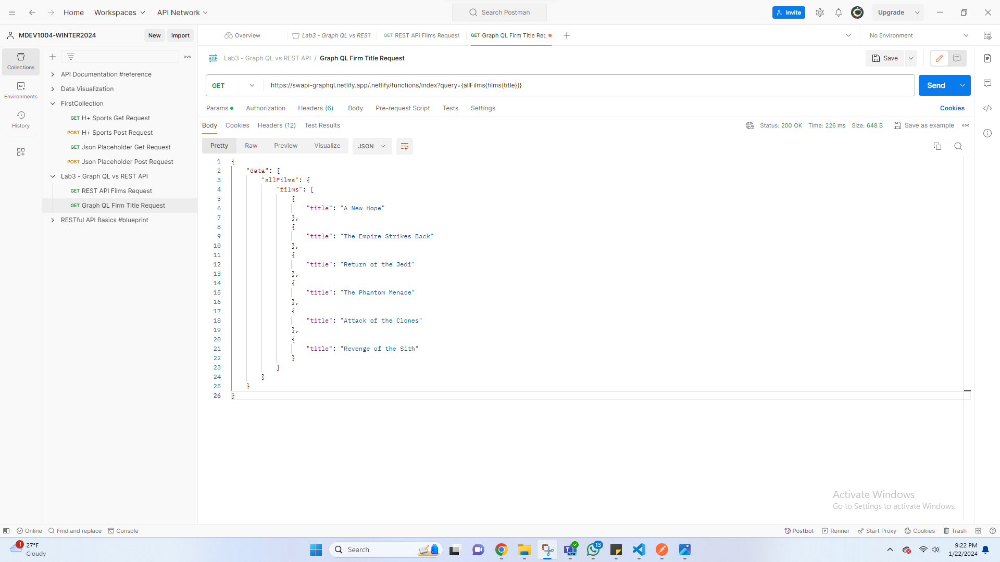
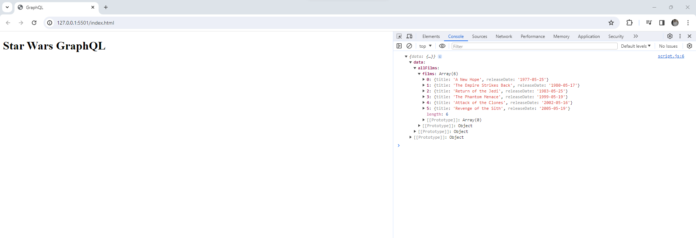
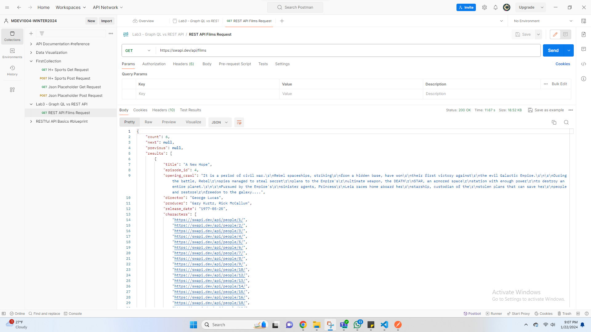
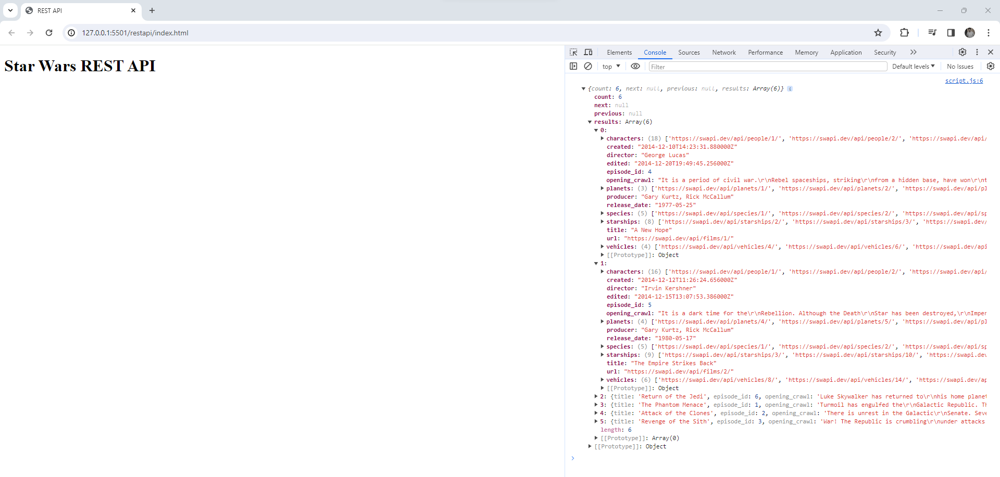

# GraphQL VS RESTAPI

## Module: 24W Mobile APIs and Frameworks - 01

### Lecturer: Shivali Dhaka

This repository explores and compares the usage of GraphQL and REST API in mobile application development. The focus is on understanding the ease of data retrieval and manipulation using both technologies.


## GraphQL

#### Postman GET Request Screenshot - GraphQL



In this example, we demonstrate a simple GraphQL GET request using Postman. The fetch URL is:

```plaintext
https://swapi-graphql.netlify.app/.netlify/functions/index?query={allFilms{films{title, releaseDate}}}
```

GraphQL makes data retrieval straightforward as we can specify the exact structure of the response we need. The screenshot above showcases the ease of obtaining desired data without the need for additional client-side deconstruction.

#### Console Output - GraphQL



The console output in `script.js` demonstrates the simplicity of handling the response when making a fetch request with GraphQL. The data received is in the exact format we requested, reducing the need for additional processing.


## REST API

#### Postman GET Request Screenshot - REST API



In contrast to GraphQL, the Postman GET request for a REST API endpoint is:

```plaintext
https://swapi.dev/api/films
```

While REST API provides the necessary data, it may be less structured, requiring additional client-side deconstruction for optimal usage.

#### Console Output - REST API



The console output in `script.js` showcases the need for further data processing when using a REST API. Unlike GraphQL, where the data is more tailored to our request, REST API responses may need additional steps to extract the desired information.

## Conclusion

This repository aims to provide insights into the differences between GraphQL and REST API, emphasizing the ease of use and data manipulation for mobile application development. Understanding these distinctions is crucial for developers when choosing the most suitable technology for their projects.
